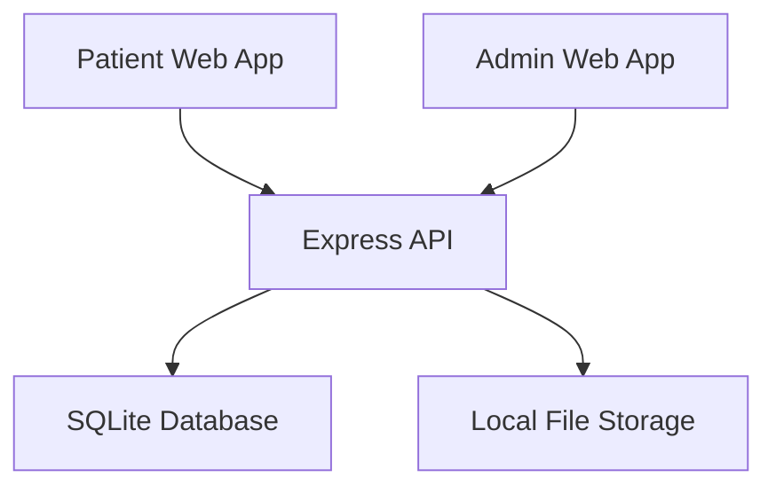

# Design Document

## Overview

The Patient Check-in System is a simple web application with two main parts: a patient form interface and an admin dashboard. Patients fill out a multi-step form, and healthcare staff can view submitted forms through an admin interface.

## Architecture

### Simple Architecture

### Technology Stack

- **Frontend**: React.js with basic JavaScript
- **Backend**: Node.js with Express.js
- **Database**: SQLite for simplicity
- **File Storage**: Local file system
- **Styling**: CSS or Tailwind CSS

## Components and Interfaces

### Patient Interface
- **Multi-step Form**: Demographics → Insurance → Clinical Forms → Confirmation
- **Progress Bar**: Shows current step (1 of 4, 2 of 4, etc.)
- **Form Validation**: Basic client-side validation with error messages
- **File Upload**: Simple file input for insurance card images

### Admin Interface
- **Form List Page**: Table showing all submitted check-ins with patient name, date, and status
- **Form Detail Page**: View complete patient information and uploaded files

## Data Models

### Database Tables

**patients**
- id, first_name, last_name, date_of_birth, address, phone, email, created_at

**insurance**
- id, patient_id, provider, policy_number, group_number, subscriber_name, card_image_path, created_at

**clinical_forms**
- id, patient_id, medical_history, current_medications, allergies, symptoms, created_at

## Error Handling

- Basic form validation with error messages
- Simple error handling for file uploads
- Basic API error responses

## Testing Strategy

- Manual testing of the complete patient flow
- Basic unit tests for form validation
- Test file upload functionality